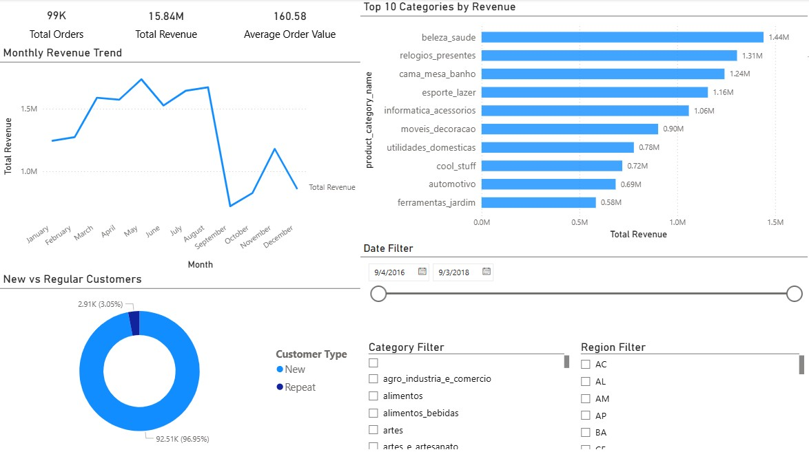

# E-Commerce Sales & Customer Insights Dashboard

## Overview
Analyzed e-commerce sales data to uncover revenue trends, customer behavior,
and product performance using SQL, Python, and Power BI.

## Project Structure
- `notebooks/` → Data cleaning & preprocessing
- `sql/` → SQL queries for KPI analysis
- `dashboard/` → Power BI dashboard and screenshots
- `data/` → Raw and processed datasets (not included in repo)

## Tech Stack
- Python (pandas, numpy)
- SQL (PostgreSQL)
- Power BI
- GitHub

## Data Files
The cleaned dataset (`cleaned_sales.csv`) is not included in this repository due to size limits.

To reproduce results:
1. Download the Olist dataset from Kaggle
2. Run `01_data_cleaning_eda.ipynb`
3. The script generates `data/processed/cleaned_sales.csv`

## Key Business Questions
1. How does revenue trend over time and are there seasonal patterns?
2. Which product categories and products contribute the most revenue?
3. What is the split between new and repeat customers, and who generates higher revenue?
4. Which regions/states drive the most sales and which underperform?
5. How do shipping cost and discounts impact revenue and profitability?
6. What are the top customers contributing to total revenue?

## Key Insights
1. Revenue shows a clear monthly trend with noticeable seasonal spikes, indicating demand patterns that can be leveraged for targeted marketing and inventory planning.
2. A small set of top product categories contributes the majority of revenue, suggesting a strong Pareto effect (80/20 rule) in product performance.
3. Repeat customers generate significantly higher order value compared to new customers, highlighting retention as a key driver for long-term growth.
4. Regional analysis shows that a few states contribute the largest share of revenue, while certain regions have high order volume but relatively low revenue, indicating low-value purchases or pricing differences.
5. Shipping cost varies strongly by region, and in some cases contributes significantly to total order value, which may impact customer satisfaction and delivery strategy.
6. High-performing categories consistently dominate sales across multiple months, while some categories show inconsistent demand, indicating seasonal or promotional dependency.
7. Customer purchasing behavior suggests that improving loyalty programs and personalized offers could increase repeat purchases and overall revenue.
8. Revenue concentration across specific products indicates opportunities to optimize inventory, pricing, and supply chain planning for high-demand items.

## Dashboard

## Dashboard Development (Power BI)
The dashboard was built in Power BI using the processed dataset (`cleaned_sales.csv`)
Key steps included:
1. Importing cleaned dataset into Power BI
2. Creating DAX measures (Total Revenue, Total Orders, AOV)
3. Designing visuals (line chart, bar chart, donut chart)
4. Adding slicers for Date, Category, and Region
5. Formatting layout with KPI cards and consistent theme

The final dashboard is saved as `sales_dashboard.pbix`

## Key DAX Measures
- Total Revenue = SUM(sales[revenue])
- Total Orders = DISTINCTCOUNT(sales[order_id])
- Average Order Value = DIVIDE([Total Revenue], [Total Orders])

## How to Run
1. Run data cleaning notebook
2. Load processed data into database
3. Execute SQL queries
4. Open dashboard file

## Future Improvements
- Add profit margin analysis
- Automate data pipeline using Airflow
- Deploy dashboard using Power BI Service
- Add forecasting model for revenue prediction

This project demonstrates an end-to-end analytics workflow including data cleaning in Python, SQL-based KPI analysis, and interactive Power BI dashboard development to deliver actionable business insights.
